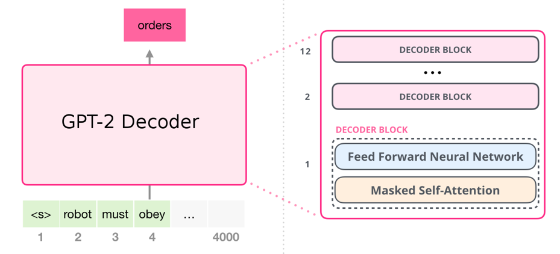
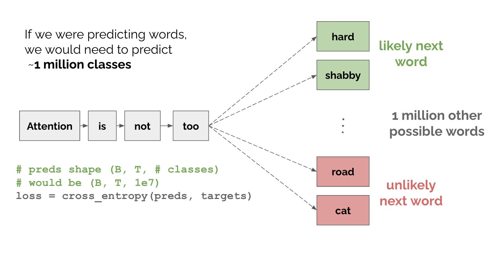
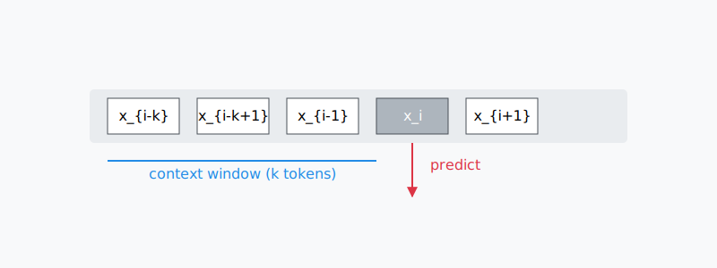
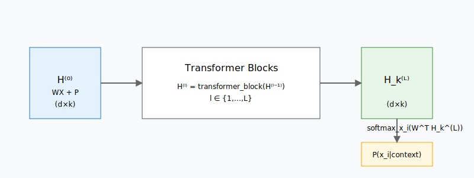
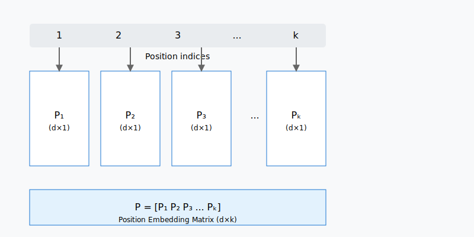
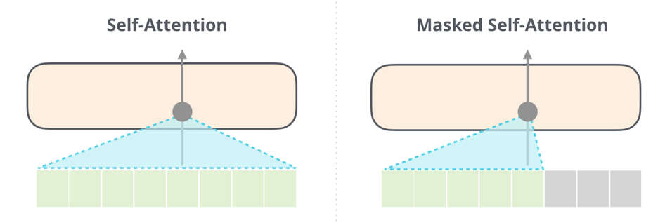
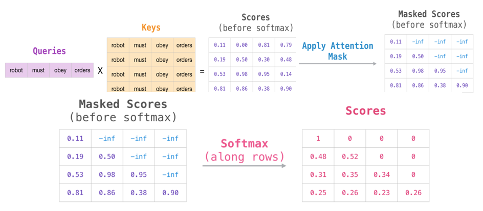

# GPT, 次の単語を予測する。


---
# GPT, 次の単語を予測する。


---

# GPTの事前学習

GPTはTransformerのデコーダにより、入力されたテキストから次の単語を予測するという言語モデルの学習を行う。事前学習に用いる、長さが$N$単語のテキストの単語列を$s = x_1, x_2, \ldots, x_N$で表す。位置$i$の単語$x_i$を予測するとき、それよりも$k$個前に出現する単語列$x_{i-k}, x_{i-k+1}, \ldots, x_{i-1}$を文脈として用い、言語モデルの負の対数尤度

$$
J = -\sum_{i=k+1}^N \log P(x_i | x_{i-k}, x_{i-k+1}, \ldots, x_{i-1})
$$

を最小化するように、$L$層のTransformerのデコーダ部分を学習する。

---



---

各単語の予測確率は、Transformerが最終層の位置$i-1$において計算した単語埋め込み$H_k^{(L)} \in \mathbb{R}^d$を用いて

$$
\begin{aligned}
H^{(0)} &= WX + P \\
H^{(l)} &= \text{transformer\_block}(H^{(l-1)}), \forall l \in \{1,\ldots,L\} \\
\end{aligned}
$$
$$
P(x_i | x_{i-k}, x_{i-k+1}, \ldots, x_{i-1}) = \text{softmax}_{x_i}(W^\top H_k^{(L)})
$$

と計算する。ここで、$X \in \mathbb{R}^{|V|\times k}$は文脈単語$x_{i-k}, x_{i-k+1}, \ldots, x_{i-1}$のワンホットベクトルを横方向に並べた行列、$W \in \mathbb{R}^{d\times |V|}$は単語埋め込み行列、$P \in \mathbb{R}^{d\times k}$は位置埋め込み行列、$H^{(l)} \in \mathbb{R}^{d\times k}$ $(l \in \{0,\ldots,L\})$は、Transformerの第$l$層における文脈単語の埋め込み表現を横方向に並べた行列である。


---


---

もちろん、位置埋め込みも必要です。




---

また、GPTは「自己回帰的」で、文章を生成する際に、「左から右へ」一つずつ単語を予測していく仕組みである。そのため、次の単語を予測するために、次の単語の後の文をマスク必要がある。


---



---

# GPTを用いた転移学習とファインチューニング
- 主要タスク：テキスト生成
- その他のタスクへの応用も可能(BERTと同じ)：
  - テキスト分類
  - 機械翻訳
  - 要約生成

---
# Natural Instructionsによるファインチューニング
Dataset: [natural-instructions](https://github.com/allenai/natural-instructions)


---

タスク定義の例（感情分類）：
```
与えられたツイートを4つのカテゴリ（Positive、Negative、
Neutral、Mixed）のいずれかに分類してください。
```

入力例：
```
I thought the Spiderman animation was good, 
but the movie disappointed me.
```

出力例：
```
Mixed
```


---
# New methods
1. [RoPE](https://arxiv.org/abs/2104.09864) → Position Embedding
    相対位置を絶対位置エンコーディングの代替
2. RMSNorm → Layer Normalization
    従来のLayerNormの計算を簡略化
3. SwiGLU → Activation Functions
    従来のGELU/ReLU活性化関数の代替
4. Flash Attention → Multi-head Attention Implementation
    従来のマルチヘッドアテンションのメモリ使用と計算効率を最適化


---

# 大規模言語モデルの計算資源の課題                  

| モデル     | パラメータ数 | 必要なGPUメモリ | 推定学習コスト・時間 |
|------------|:-------------|:----------------|:--------------------|
| GPT-4      | 約1.8兆     | 数千GPU         | 数億ドル・数ヶ月    |
| LLaMA 2 70B| 700億       | 140GB以上       | 数千万ドル・数週間  |

**主な課題**：
- 💰 莫大な計算コスト：数億ドル規模の投資が必要
- 🖥️ 大規模なインフラ：数千個のGPUクラスターが必要
- ⚡ 電力消費：GPT-3の学習で約1,287 MWh（一般家庭120世帯/年分）

---

# モデルの効率化手法

1. スケーリング則の活用
   - 計算リソースの最適配分

2. 量子化 (Quantization)
   - モデルサイズの削減

3. パラメータ効率的な微調整
   - 効率的な学習手法

4. モデルシャーディング
   - 分散処理による最適化

---

# スケーリング則の活用

**Chinchillaの法則**による最適化：

- 従来の考え方：より大きいモデル = より良い性能
- 新しい発見：データとモデルサイズのバランスが重要

**具体例**：
- GPT-3 (175B/1Tトークン) vs Chinchilla (70B/4Tトークン)
  - 同じ計算コストでより高い性能
  - 4倍のデータ、1/2.5のパラメータ数

**実践的な利点**：
- 計算効率の向上
- コスト削減
- 環境負荷の低減

---

# 量子化 (Quantization)

**LLaMA 2 70Bでの実例**：

| 精度    | メモリ使用量 | 性能影響    |
|---------|-------------|------------|
| FP16    | 140GB       | ベースライン |
| INT8    | 70GB        | 最小限の低下 |
| INT4    | 35GB        | 許容範囲内  |

- 推論コストの大幅削減
- デバイスの要件緩和
- レイテンシの改善

---

# パラメータ効率的な微調整

**LoRA/QLoRAの革新**：

| 手法          | 必要メモリ | パラメータ比 |
|--------------|-----------|-------------|
| フルFT       | 200GB+    | 100%        |
| LoRA         | 16GB      | 0.1%        |
| QLoRA        | 10GB      | 0.1%        |

- 低リソースでの学習が可能
- 高速な学習と展開
- 複数タスクの効率的な管理

---

# 知識蒸留
### 概要：
- 大規模モデル（教師）から小規模モデル（生徒）への知識転移技術
- 計算コストを抑えながら性能を維持する圧縮手法
- より効率的なモデルデプロイを実現

### 例: [llama3.1 (8B) → llama3.2 (1B)](https://pytorch.org/torchtune/0.3/tutorials/llama_kd_tutorial.html)
- より小さいモデルで同等性能
- 推論速度2倍向上
- メモリ使用量50%削減

---
# 知識蒸留の仕組み

学生モデルだけがパラメータを更新する。

---
# Loss
```
Loss = α * KL(教師分布 || 生徒分布) + (1-α) * CE(正解ラベル, 生徒予測)
```
1. KL項：教師モデルの確率分布と生徒モデルの確率分布の差異を測定

    例：教師が [0.7, 0.2, 0.1] と予測する時、生徒も同様の分布を目指す


2. CE項：通常の教師あり学習の損失（正解ラベルとの差）
3. α：両者のバランスを調整するパラメータ（通常0.5前後）

---
参考リンク
[Generating Synthetic Comments to Balance Data for Text Classification - GPT2](https://humboldt-wi.github.io/blog/research/information_systems_1920/text_generation/)

